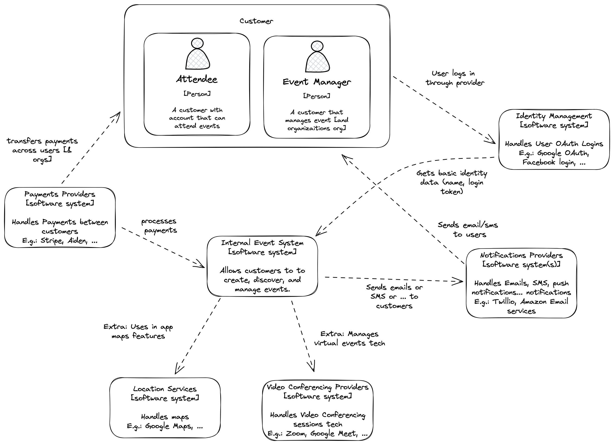
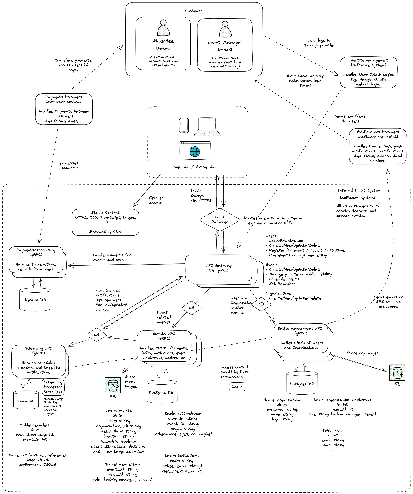

# Get Gatherly Going! - an Event Company Architecture Kata

This is an Architecture Kata for an Events system, with an exisiting design.

## Situation Context:

The company commissioned an architect to design an events system for them, but the architect has
had to move onto another project, and left only the design they created.
Your task is to review the design, and:

1. Identity potential problems
2. Suggest correction
3. Suggest alternative options that should be considered

## About the system:

Gatherly - a new event system for the modern human
People want an easy way to create, discover, and manage events. 
Whether it’s a private dinner, a public concert, or an online workshop, organisers need a system 
that handles invitations, visibility, reminders, and payments. Attendees need a smooth way to RSVP, 
stay updated, and receive notifications across devices.

### Requirements
1. Private events: organiser-controlled access, invitation only.  
2. Public events: discoverable by anyone near the location or through search.  
3. Online or in-person: links and integrations for video platforms or links to a physical location.  
4. Recurring events: support for daily/weekly/monthly schedules.  
5. Reminders: via email, SMS, or push notifications.  
6. Payments: organisers can charge for attendance; the platform may handle payment processing and refunds.  
7. Multi-device access: responsive web and mobile-friendly experience.  

### Additional Considerations
**Scalability:**

Handle large public events (e.g., festivals with thousands of RSVPs).
Support global usage with low latency.

**Security:**

Access control for private events.
Protect user data (attendees’ contact details, payment info).
Prevent fake events, spam, and fraudulent payment claims.

**Budget & Revenue Model**

Existing business with sufficient budget to explore a few alternative designs and tools

**Regional Rollout**

Launch in one city first, but the system should be able to scale to multiple cities/countries later.
Must support timezone handling and local currency for payments.

**Compliance**

Payments must comply with PCI DSS (if implemented).
User data must comply with GDPR/CCPA.
Age restrictions: events may require 18+ verification for some categories.

**User Growth & Engagement**

Expect growth to 10k daily active users in year one, scaling to 100k+ DAUs within 2–3 years.
System should encourage engagement (reminders, recurring events, easy RSVP flow) without spamming users.

**Trust & Safety**

Fake events or scams could harm brand trust - the system must support reporting, moderation, and abuse detection.
Reputation features (e.g., verified organizers, reviews) are on the roadmap.

**Partnership Opportunities**

Possible integrations with ticketing providers or video conferencing tools (Zoom, Google Meet).
Ads or sponsored events may become a revenue stream later.

### Current Designs

#### C4 System Context Diagram

#### C4 Container Diagram

